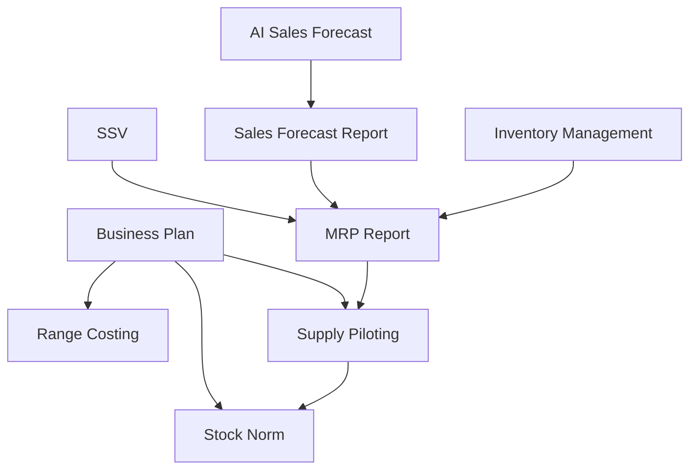

# Demand Digital Product Group — Product Map

> **Source**: "Demand Digital Group Product Presentation".

## Products

| Product | Purpose | Planning horizon (indicative) |
|---|---|---|
| **Business Plan** | Build a commercial trajectory for Sports. | Tactical (3-year BP) |
| **Range Costing** | Validate a profitable assortment. | Tactical / pre-season |
| **Stock Norm** | Build the ideal stock level during the season. | Pre-season / in-season |
| **Supply Piloting** | Steer stock level projection in accordance with commercial targets. | Tactical → in-season |
| **SSV** | Validate Sales & Purchase forecasts for next season. | Pre-season |
| **AI Sales Forecast** | Forecast demand to be sustained, based on machine-learning algorithms. | In-season |
| **Sales Forecast Report** | Manage the sales forecast to be applied for replenishment calculations. | In-season |
| **Inventory Management** | Set the right stock level for replenishment. | In-season |
| **MRP (Report)** | Calculate the right order level to sustain demand. | In-season |

Horizons are an interpretation cross-referenced with persona responsibilities — to be confirmed by product teams.

## Workflow and dependencies

## Observations

- **Two chains** converge: an *economic framework* chain (Business Plan → Range Costing / Stock Norm / Supply Piloting) and an *operational replenishment* chain (Forecast / Inventory / SSV → MRP).
- **Supply Piloting** closes the loop: it is fed by the Business Plan and by MRP outputs, and feeds Stock Norm.
- Any transversal change (e.g. a new business model dimension) potentially impacts every node of this graph.
